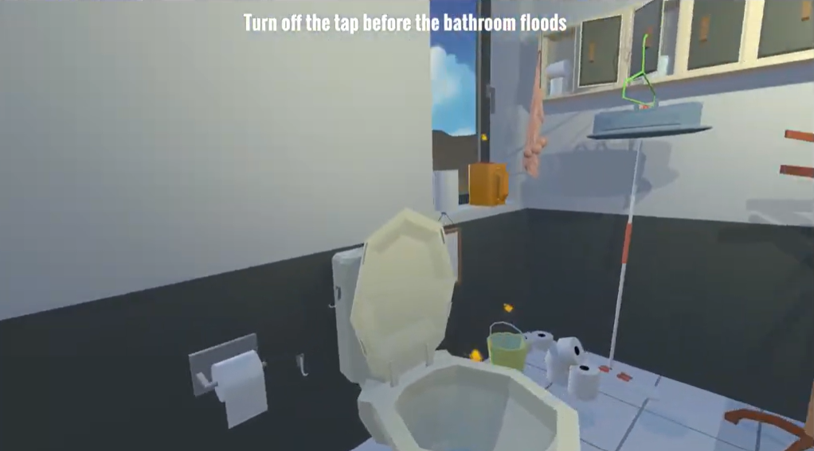

# Miniature Mayhem

Miniature Mayhem is a first-person game developed in Unity where the player has been shrunk down and must navigate an oversized bathroom while trying to stop the room from flooding.

The player must explore the environment, avoid hazards and reach the running tap before the timer expires.

## 🎮 Gameplay Demo

Click image to watch 

## 🕹️ Features

- First-person player movement
- Oversized bathroom environment
- Rising water / flooding mechanic
- Countdown timer and win/fail conditions
- Interactive tap that the player must reach and turn off
- Spider enemy using Unity NavMesh AI
- Audio and sound effects
- User interface for gameplay information
- Environmental animations and effects
- Level optimisation and occlusion/culling

## 🛠️ Technologies

- Unity
- C#
- Unity NavMesh
- ProBuilder
- Blender / 3D assets

## 🎯 Objective

The player must navigate through the oversized bathroom and reach the tap before the room floods.

The environment is designed around the player's miniature scale, turning everyday bathroom objects into obstacles and platforms.

## 💻 Play the Game

A playable Windows build is available through the **Releases** section of this repository.

1. Download the latest Windows release.
2. Extract the ZIP file.
3. Run `Miniature Mayhem.exe`.

## 📂 Source Code

This repository contains the Unity project source files including the game's C# scripts, scenes and project settings.

## 👤 Developer

Developed by Adam Christensen as part of my Computer Science (Games Development) studies.
